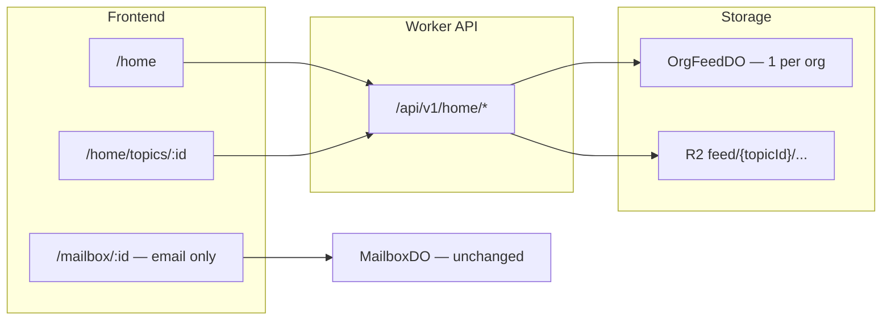

# Home Social Feed Plan

## Vấn đề

| Hiện tại | User muốn |
|----------|-----------|
| "Feed" = inbox cá nhân (`/mailbox/:id/emails/inbox`) | Mailbox cá nhân = **email thuần** (Inbox/Sent/Drafts) |
| Board = public mailbox, topic = gửi email | **Home** = khu org-wide, topic do admin tạo |
| Reply = email thread | **Comment** = hành vi social, không phải email |
| Không có like/dislike | Like + Dislike trên topic |
| Ảnh qua email attachment | Upload ảnh trực tiếp trong topic/comment |

**Pivot có chủ đích:** Plan `260605-email-social-network` ghi non-goal "feed detached from email" — user override 2026-06-08.

## Success Criteria (MVP)

- [ ] Route `/home` hiển thị danh sách topics (card: author, title, preview, ảnh thumb, like/dislike counts, comment count)
- [ ] Admin (`ACCESS_EMAIL_ADDRESSES`) tạo topic mới + upload ảnh (≤4MB, JPEG/PNG/WebP)
- [ ] Mọi org member (`EMAIL_ADDRESSES` + `ACCESS_EMAIL_ADDRESSES`) comment + like/dislike
- [ ] Topic detail `/home/topics/:id` — thread comment + reaction bar
- [ ] Mailbox cá nhân: folder inbox label = **Inbox** (bỏ "Relationship Feed"); không còn "New topic" trong sidebar mailbox
- [ ] Board mailbox cũ vẫn hoạt động (không break) nhưng Home là surface chính cho social
- [ ] Tests + typecheck pass; deploy `box.vsbg.vn`

## 3 hướng đã xem

| # | Hướng | Effort | Trade-off |
|---|--------|--------|-----------|
| A | **OrgFeedDO mới** — SQLite topics/comments/reactions | ~5 ngày | ✅ UX social thuần, tách email; cần DO migration |
| B | Reuse board mailbox + email reply | ~2 ngày | ❌ Vẫn giống email, like/dislike phải nhồi vào MailboxDO |
| C | Hybrid FeedDO + email notify khi topic mới | ~7 ngày | Overkill MVP |

**Chọn A** — đúng yêu cầu "tách riêng", schema gọn, ship trong 1 sprint ADHD.

## Kiến trúc

**OrgFeedDO:** `idFromName("vsbg-home")` — single instance, SQLite:
- `topics`, `topic_images`, `comments`, `comment_images`, `topic_reactions`

**Access model:**
- `read` — bất kỳ ai có org membership (cùng rule `filterMailboxIdsForAccess` / platform admin)
- `create_topic` — `ACCESS_EMAIL_ADDRESSES` (admin) MVP; phase sau mở `member`
- `comment` / `react` — mọi org member

## Phases

| Phase | File | Output |
|-------|------|--------|
| 01 | [phase-01-org-feed-do-api.md](./phase-01-org-feed-do-api.md) | FeedDO + migrations + REST API |
| 02 | [phase-02-home-ui.md](./phase-02-home-ui.md) | `/home` list + create topic + images |
| 03 | [phase-03-comments-reactions.md](./phase-03-comments-reactions.md) | Comment thread + like/dislike |
| 04 | [phase-04-nav-separation.md](./phase-04-nav-separation.md) | Tách nav, rename inbox, redirect defaults |
| 05 | [phase-05-ship.md](./phase-05-ship.md) | Tests, deploy, smoke |

## Dependencies

- Reuse: `profile-avatar.ts` decode/validate pattern cho ảnh feed
- Reuse: `access.ts` / `isPlatformAdmin` cho auth
- Reuse: `MailboxAvatar` component cho author chip
- Không đụng: send/receive email pipeline, MailboxDO email tables

## Risks

| Risk | Mitigation |
|------|------------|
| Thêm DO = wrangler migration | Tag `v4`, class `OrgFeedDO` |
| Fan-out chậm | Single DO — OK đến ~10k topics; paginate |
| Like brigading | 1 reaction/user/topic, toggle |
| XSS trong body | Sanitize HTML giống compose (existing lib) |

## Out of scope (MVP)

- Nested comment replies > 1 level
- Edit/delete topic
- Push notifications
- Board mailbox deprecation / migration
- Email notify khi có topic mới

## Execution strategy (user 2026-06-08)

**Làm lần lượt — test/debug xong mới phase tiếp.** Không nhảy phase.

| Gate | Trước khi sang phase sau |
|------|--------------------------|
| P01 → P02 | `pnpm test` + `pnpm typecheck` + curl API tạo/list topic |
| P02 → P03 | UI `/home` load + admin tạo topic + ảnh trên browser |
| P03 → P04 | Comment + like/dislike smoke 2 users |
| P04 → P05 | Nav đúng: login → `/home`, mailbox = Inbox |
| P05 | `pnpm deploy` + prod smoke |

## Next step

**Switch Cursor → Agent mode**, rồi gõ: `cook phase 01 home feed`

Plan path: `docs/plans/260608-home-social-feed/phase-01-org-feed-do-api.md`